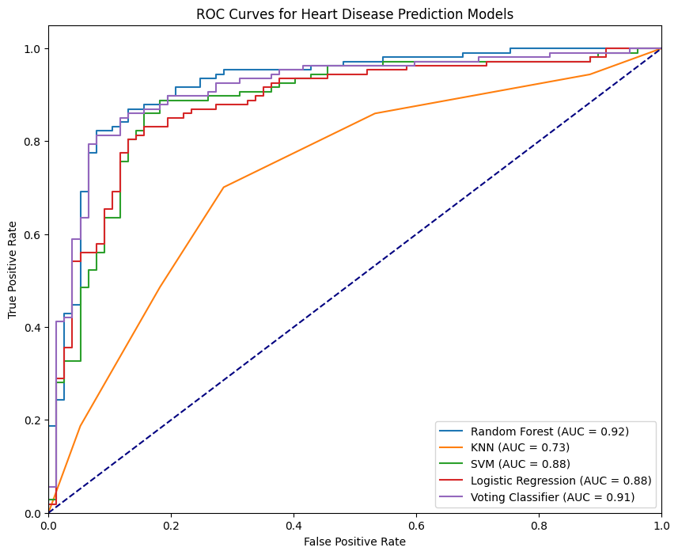

# <h1>Cardiovascular Disease Prediction Project</h1>

This project predicts the likelihood of cardiovascular disease based on various health parameters. The model uses an ensemble of machine learning algorithms to improve accuracy and provides an interactive web-based GUI for user-friendly input and result interpretation.

## Table of Contents
- [Project Overview](#project-overview)
- [Features](#features)
- [Setup and Installation](#setup-and-installation)
- [Usage](#usage)
- [Data Preprocessing](#data-preprocessing)
- [Models](#models)
- [Ensembling Technique](#ensembling-technique)
- [User Interface](#user-interface)
- [Results and Evaluation](#results-and-evaluation)
- [Acknowledgements](#acknowledgements)

## Project Overview
This project leverages machine learning algorithms like Logistic Regression, Random Forest, Support Vector Machine, K-Nearest Neighbours, and XGBoost to predict cardiovascular disease presence. A voting ensemble aggregates individual model predictions for optimal performance. An interactive GUI built with Streamlit enables real-time predictions based on user inputs.

## Features
- **Data Preprocessing**: Handles missing values, encodes categorical data, and scales numerical features.
- **Machine Learning Models**: Trains and optimizes multiple classifiers.
- **Voting Ensemble**: Aggregates individual models for enhanced accuracy.
- **Interactive GUI**: Provides an accessible interface for making predictions and viewing model metrics.

## Setup and Installation
1. Clone the repository:
   ```bash
   git clone https://github.com/karthikEdara24/Early-Detection-of-Cardio-Vascular-Disease-using-Machine-Learning.git
   ```

2. Install required packages:
   ```bash
   pip install -r requirements.txt
   ```

3. Ensure the dataset (`heart.csv`) is placed in the root directory or specify its path in the code.

## Usage
To start the application, run:
```bash
streamlit run app.py
```

This will open the web application in your default browser, where you can enter health parameters and receive a prediction.

## Data Preprocessing
1. **Handling Missing Values**: The dataset is checked for any missing values, which are either imputed or removed to maintain model integrity.
2. **Encoding Categorical Variables**: Categorical variables like gender and chest pain type are encoded to numerical values.
3. **Feature Scaling**: Normalizes numerical features, essential for distance-based models like K-Nearest Neighbors.
4. **Feature Selection**: Uses Recursive Feature Elimination (RFE) to select the most important features, reducing dimensionality and noise.

## Models
The project includes five machine learning models:
- **Logistic Regression**: For binary classification and interpretable feature importance.
- **Random Forest**: An ensemble of decision trees to handle non-linearity and reduce overfitting.
- **Support Vector Machine (SVM)**: Finds an optimal boundary between classes, using the RBF kernel.
- **K-Nearest Neighbours (KNN)**: A distance-based classifier.
- **XGBoost**: A gradient-boosted algorithm particularly effective on tabular data.

Hyperparameters for each model are optimized using GridSearchCV or RandomizedSearchCV to ensure peak performance.

## Ensembling Technique
An ensemble model combines the individual predictions using a **soft voting** approach:
- Each model outputs probability estimates, and the final prediction is based on the averaged probabilities.
- This technique improves the overall prediction accuracy and minimizes individual model weaknesses.

## User Interface
The Streamlit-powered GUI allows users to:
1. Input their health data (age, gender, chest pain type, etc.).
2. Receive a real-time prediction on the likelihood of cardiovascular disease.
3. View performance metrics (accuracy, precision, recall, and F1-score).
4. Plot and visualize ROC curves for model performance insights.

## Results and Evaluation
The model performance is evaluated using the following metrics:
- **Accuracy**: Percentage of correct predictions.
- **Precision**: Proportion of positive identifications that were actually correct (0.85).
- **Recall**: Proportion of actual positives identified correctly (0.85).
- **F1-Score**: The harmonic mean of precision and recall (0.85).
- **ROC Curve**: A plot showing the model's performance at various threshold levels.
  
  

The ensemble classifier achieves a higher accuracy than individual models, with ROC curves providing visual insight into the model's predictive capability.

Presentation
For a deeper understanding of this project, you can review our project presentation:
[Download the Presentation](https://github.com/karthikEdara24/Early-Detection-of-Cardio-Vascular-Disease-using-Machine-Learning/blob/main/PPT.pdf)


## Acknowledgements
- **Dataset**: This project utilizes a publicly available heart disease dataset.
- **Libraries**: Thanks to the developers of [Pandas](https://pandas.pydata.org/), [Scikit-Learn](https://scikit-learn.org/), [XGBoost](https://xgboost.readthedocs.io/), and [Streamlit](https://streamlit.io/) for providing the tools necessary for this project.
- **Contributors**: [Karthik Edara](https://github.com/karthikEdara24), [Mannem Pardhava](https://github.com/Pardhu0007)


> **Note**: This project is for educational purposes and should not be used as a substitute for medical advice.

